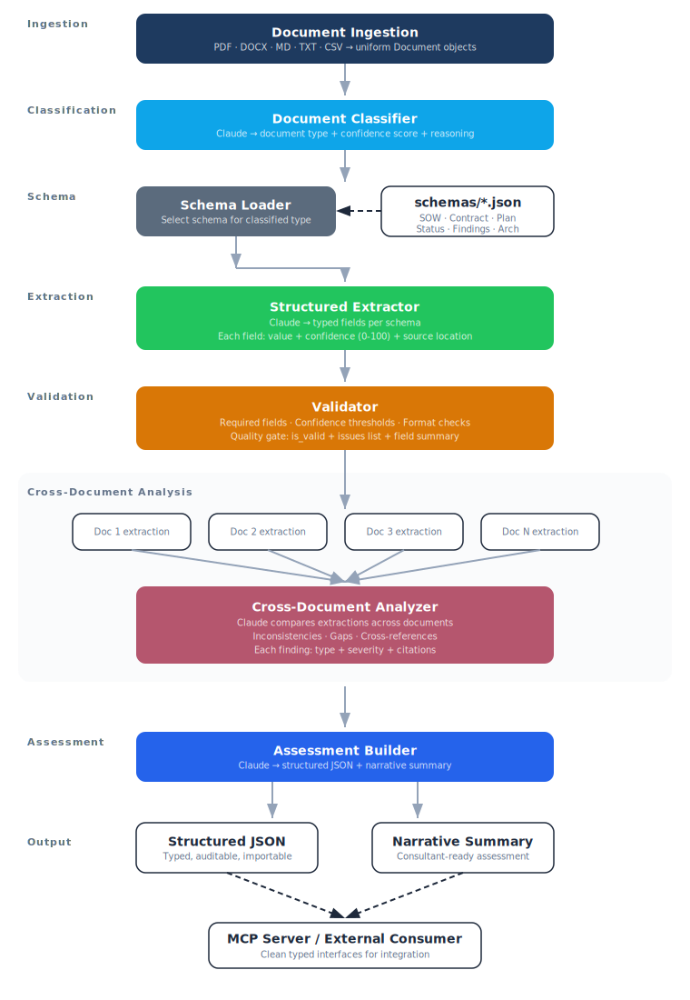

# Document Intelligence Pipeline

A document intelligence system that ingests consulting and enterprise documents, classifies them by type, extracts structured fields, validates extractions, performs cross-document analysis, and produces auditable assessments with narrative summaries.

## Architecture

<p align="center">
  
</p>

## Supported Document Types

Each type has an extraction schema defining what fields to look for. Adding a new document type means adding a new JSON schema file — no code changes required.

| Type | Description | Example Fields |
|------|-------------|----------------|
| **SOW** | Statement of Work | client, deliverables, milestones, total value, payment terms |
| **Contract** | MSA / Legal Agreement | parties, governing law, liability cap, IP terms, termination |
| **Project Plan** | Execution plan | phases, milestones, team roles, dependencies, risks |
| **Status Report** | Periodic update | accomplishments, blockers, budget status, RAG indicators |
| **Findings** | Assessment / Audit | findings with severity, recommendations, risk rating |
| **Architecture Doc** | System design | components, tech stack, design decisions, constraints |

## Key Design Decisions

- **Structured output, not prose.** Every extraction produces typed JSON with confidence scores and source citations. Structured output is testable output.
- **Schema-driven extraction.** Document types are defined as JSON schema files. The same extraction logic works for any schema — adding a type is a data change, not a code change.
- **Evaluation from Day 1.** Classification accuracy, extraction completeness, and cross-document analysis quality are measured against a test corpus with known ground truth.
- **Clean importable interfaces.** Pipeline functions have typed inputs and structured outputs, designed for consumption by external projects.

## Quick Start

```bash
# Clone and set up
git clone https://github.com/Brinkv3/doc-intelligence.git
cd doc-intelligence
python3.12 -m venv .venv
source .venv/bin/activate
pip install -r requirements.txt

# Set your API key
cp .env.example .env
# Edit .env with your Anthropic API key

# Process a single document
python -c "
from src.pipeline import process_document
result = process_document('path/to/document.pdf')
print(result.to_dict())
"

# Process a directory with cross-document analysis
python -c "
from src.pipeline import process_and_assess
assessment = process_and_assess('path/to/documents/')
print(assessment.to_json())
"

# Run the full evaluation suite
python eval/run_eval.py
```

## Interactive Demo

A Streamlit app provides a visual interface over the pipeline — upload documents and see classification, extraction, validation, and cross-document analysis results in real time.

```bash
pip install -r requirements-demo.txt
streamlit run app.py
```

Opens at `http://localhost:8501`. Two modes:

- **Single document** — upload a file, see it classified with a confidence score, fields extracted into a table with per-field confidence and source citations, and a validation summary
- **Compare documents** — upload 2+ files, see individual results plus cross-document analysis flagging inconsistencies, gaps, and confirmed alignments

The sidebar dynamically lists all document types discovered from the `schemas/` directory.

## Evaluation Results

Against the test corpus of 6 consulting documents:

| Metric | Result |
|--------|--------|
| Classification accuracy | 6/6 (100%) |
| Field extraction | 70/70 fields (100%) |
| Validation pass rate | 6/6 valid |
| Cross-document findings | 22 findings (5 high, 7 medium, 10 low) |

Cross-document analysis detects real structural issues: termination notice period conflicts between SOW and MSA, milestone date mismatches, security findings not reflected in project risk tracking, and potential scope creep from archived data requests contradicting SOW exclusions.

## Project Structure

```
doc-intelligence/
├── app.py                ← Streamlit demo (streamlit run app.py)
├── .streamlit/           ← Streamlit theme config
├── schemas/              ← Document type extraction schemas (JSON)
│   ├── sow.json
│   ├── contract.json
│   ├── project_plan.json
│   ├── status_report.json
│   ├── findings.json
│   └── architecture_doc.json
├── src/
│   ├── ingest.py         ← Document parsers (PDF, DOCX, MD, TXT, CSV)
│   ├── classifier.py     ← Document type classification
│   ├── schema_loader.py  ← Load and discover extraction schemas
│   ├── extractor.py      ← Structured field extraction per schema
│   ├── validator.py      ← Extraction validation and quality checks
│   ├── analyzer.py       ← Cross-document analysis
│   ├── assessor.py       ← Assessment output (JSON + narrative)
│   └── pipeline.py       ← End-to-end orchestration
├── eval/
│   ├── test_documents/   ← Sample docs with known ground truth
│   ├── ground_truth.json ← Expected classifications
│   ├── run_eval.py       ← Full pipeline evaluation
│   └── run_*.py          ← Component-level evaluations
├── adr/                  ← Architecture Decision Records
└── requirements.txt
```

## Dependencies

- **anthropic** — Claude API for classification, extraction, analysis, and narrative generation
- **PyMuPDF** — PDF parsing
- **python-docx** — DOCX parsing
- **pandas** — CSV/tabular data handling
- **pydantic** — Schema validation
- **tiktoken** — Token counting

## Portfolio Context

This is one of three repositories demonstrating breadth across the enterprise AI application landscape:

| Repo | Demonstrates |
|------|-------------|
| [rag-pipeline](https://github.com/Brinkv3/rag-pipeline) | Retrieval, grounding, evaluation, governance, multi-agent orchestration |
| **doc-intelligence** (this repo) | Classification, structured extraction, cross-document reasoning |
| consulting-mcp-server | Protocol interoperability — exposes both as MCP tools |

## License

[MIT](LICENSE) (c) 2026 Carter Brinkley Consulting LLC
